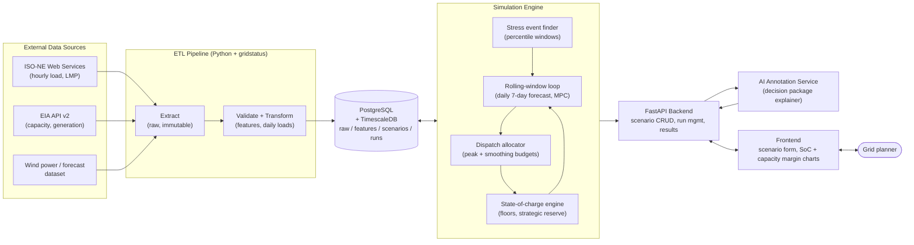

# Diagram and Image References for the Slide Deck — 2026-07-16

Curated sources for building the system design diagram and supporting visuals.
Check licensing before embedding: ISO-NE, NREL, and DOE materials are generally usable with attribution; commercial press images are not.

## Storage technology concept imagery (the "seafloor reserve")

| Image / asset | Where | Use on slide |
|---|---|---|
| StEnSea concrete sphere concept renders | https://www.iee.fraunhofer.de/en/topics/stensea.html | "What is a seafloor wind energy reserve" |
| Stored Energy at Sea overview + figures | https://en.wikipedia.org/wiki/Stored_Energy_at_Sea | Background/appendix |
| Ocean Grazer Ocean Battery cutaway | https://oceangrazer.com/ (via https://cleantechnica.com/2024/11/04/3-d-printed-concrete-enlisted-for-futuristic-subsea-energy-storage-demonstration/) | Alternative concept |
| ESIG deep sea pumped storage explainer | https://www.esig.energy/deep-sea-pumped-storage/ | Technology credibility |

## Grid context imagery (ISO-NE / Boston)

| Image / asset | Where | Use on slide |
|---|---|---|
| ISO-NE maps and diagrams library | https://www.iso-ne.com/about/key-stats/maps-and-diagrams | System map, resource mix |
| New England geographic transmission map (PDF) | https://www.iso-ne.com/static-assets/documents/2020/04/new-england-geographic-diagram-transmission-planning.pdf | "The grid we model" |
| ISO Express real-time load charts (screenshot) | https://www.iso-ne.com/isoexpress/ | Hourly load shape |
| EIA New England dashboard | https://www.eia.gov/dashboard/newengland/electricity | Demand/price context |
| Duck curve explainer visuals | https://isonewswire.com/2021/04/22/a-queue-and-a-curve-signs-in-new-england-of-a-greener-grid-this-earth-day/ , https://solarmagazine.com/us-grid-operators-utilities-getting-to-know-their-duck-curves/ | Net load / duck curve slide |
| NREL offshore wind grid integration article (illustrations) | https://www.nrel.gov/news/program/2021/offshore-wind-feeds-grid-on-shore.html | Offshore wind to shore |

## Software architecture references

| Asset | Where | Use |
|---|---|---|
| VPP-Sim architecture figure (FastAPI + TimescaleDB + optimizer) | https://www.researchgate.net/publication/397208596_VPP-Sim_A_Modular_Open-Source_Framework_for_Developing_and_Deploying_ML-Driven_Strategies_in_Virtual_Power_Plants | Pattern proof for our stack |
| gridstatus library (data layer) | https://github.com/gridstatus/gridstatus | ETL slide |
| ISO-NE Web Services API docs | https://webservices.iso-ne.com/docs/v1.1/ | Data source slide |
| PostgreSQL/TimescaleDB energy data patterns | https://dev.to/tigerdata/10-energy-data-problems-developers-can-now-solve-with-postgresql-2n5d | Schema slide |

## Proposed system design diagram (draft for the deck)

Render this mermaid as the master architecture slide; it maps one-to-one to the
Software Architecture Model document's outline steps.

Slide deck skeleton suggestion (10 slides): problem statement, why now (regulatory tailwind: Order 2023 + cluster study), the seafloor reserve concept, scenario question (reserve vs direct-to-grid), data sources, system architecture (diagram above), simulation loop walkthrough, sample outputs (SoC trajectory, capacity margin), tradeoff metrics, roadmap/asks.
