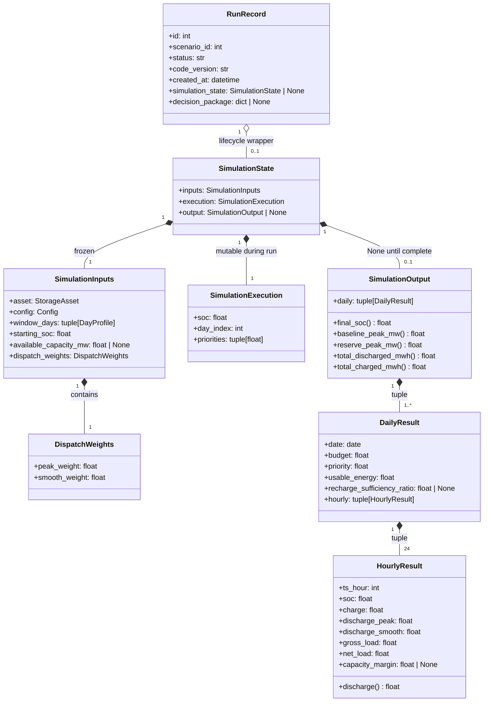

# Proposed Simulation State Model

*Derived from `docs/STATE_MODEL.md`. This document presents the proposed consolidated model as a class diagram and per-component field matrices. Each matrix is followed by a one-sentence summary (≤ 10 words) of the original component it replaces.*

---

## State Classification Diagram

---

## `DispatchWeights`

*Proposed: frozen 2-field dataclass bundling the per-objective blending ratio.*

| Field | Type | Classification | Mutable? | Owned by |
|---|---|---|---|---|
| `peak_weight` | `float` | Config input — weight for peak-shaving objective | No | `SimulationInputs` |
| `smooth_weight` | `float` | Config input — weight for ramp-smoothing objective | No | `SimulationInputs` |

> *Original: Unnamed float pair passed independently to `simulate()`.*

---

## `SimulationInputs`

*Proposed: frozen bundle of everything `simulate()` reads but never writes.*

| Field | Type | Classification | Mutable? | Owned by |
|---|---|---|---|---|
| `asset` | `StorageAsset` | Config input — capacity, power, efficiency, reserve fractions | No | `SimulationState` |
| `config` | `Config` | Config input — engine constants (weights, fractions, budget rule) | No | `SimulationState` |
| `window_days` | `tuple[DayProfile, ...]` | Input data — ordered sequence of days to simulate | No | `SimulationState` |
| `starting_soc` | `float` | Config input — SoC (MWh) at the start of day 0 | No | `SimulationState` |
| `available_capacity_mw` | `float \| None` | Config input — grid capacity limit for margin calculation; `None` if unused | No | `SimulationState` |
| `dispatch_weights` | `DispatchWeights` | Config input — peak/smooth blending ratio | No | `SimulationState` |

> *Original: Unnamed args to `simulate()` with no grouping.*

---

## `SimulationExecution`

*Proposed: named dataclass holding the three values that evolve during a run.*

| Field | Type | Classification | Mutable? | Owned by |
|---|---|---|---|---|
| `soc` | `float` | **Primary mutable state** — current state of charge (MWh); the only value that evolves step-by-step | Yes — updated every hour | `SimulationState` |
| `day_index` | `int` | Execution cursor — which day the loop is currently processing | Yes — incremented per day | `SimulationState` |
| `priorities` | `tuple[float]` | Pre-computed input — priority score per window day; read-only after construction | No (after init) | `SimulationState` |

*Note: `baseline_peak` and `reserve_peak` are tracking variables whose sole purpose is to become `SimulationOutput` fields. They may live here during execution or be computed post-hoc from `daily` as properties (see T1 in `STATE_MODEL.md`).*

> *Original: Five unnamed local variables scattered inside `simulate()`.*

---

## `SimulationOutput`

*Proposed: frozen result object; redundant scalar fields become computed properties.*

| Field / Property | Type | Classification | Stored? | Owned by |
|---|---|---|---|---|
| `daily` | `tuple[DailyResult, ...]` | **Primary output** — the authoritative per-day record | Yes | `SimulationState` |
| `final_soc` *(property)* | `float` | Derived — `daily[-1].hourly[-1].soc` | No — computed on access | N/A |
| `baseline_peak_mw` *(property)* | `float` | Derived — `max(h.gross_load for all hours)` | No — computed on access | N/A |
| `reserve_peak_mw` *(property)* | `float` | Derived — `max(h.net_load for all hours)` | No — computed on access | N/A |
| `total_discharged_mwh` *(property)* | `float` | Derived — `sum(h.discharge for all hours)` | No — computed on access | N/A |
| `total_charged_mwh` *(property)* | `float` | Derived — `sum(h.charge for all hours)` | No — computed on access | N/A |

*`frozen=True`. All callers that currently access `result.final_soc`, `result.baseline_peak_mw`, `result.reserve_peak_mw` continue to work unchanged; the properties preserve the same attribute names.*

> *Original: Mutable `SimulationResult` with three redundant stored scalars.*

---

## `HourlyResult` (revised)

*Proposed: `discharge` exposed as a property; components remain the stored truth.*

| Field / Property | Type | Classification | Stored? | Owned by |
|---|---|---|---|---|
| `ts_hour` | `int` | Input echo — hour index 0–23 | Yes | `DailyResult` |
| `soc` | `float` | **Primary output** — SoC after discharge and charge steps | Yes | `DailyResult` |
| `charge` | `float` | **Primary output** — energy charged this hour (MWh) | Yes | `DailyResult` |
| `discharge_peak` | `float` | **Primary output** — peak-shaving component (MWh) | Yes | `DailyResult` |
| `discharge_smooth` | `float` | **Primary output** — ramp-smoothing component (MWh) | Yes | `DailyResult` |
| `gross_load` | `float` | Input echo — load before storage acts (MW) | Yes | `DailyResult` |
| `net_load` | `float` | Derived — `gross_load − discharge`; charge never enters (D2) | Yes | `DailyResult` |
| `capacity_margin` | `float \| None` | Derived — `available_capacity_mw − net_load`; `None` if unused | Yes | `DailyResult` |
| `discharge` *(property)* | `float` | Derived — `discharge_peak + discharge_smooth` | No — computed on access | N/A |

*`frozen=True`. The constraint `discharge = discharge_peak + discharge_smooth` is now enforced structurally rather than by convention. All callers using `h.discharge` continue to work unchanged.*

> *Original: `discharge` stored with both components; invariant type-unenforced.*

---

## `SimulationState` (root)

*Proposed: single root object describing a simulation before, during, and after execution.*

| Field | Type | Classification | Mutable? | Owned by |
|---|---|---|---|---|
| `inputs` | `SimulationInputs` | Config + data bundle — everything the engine reads | No (frozen) | `RunRecord` or caller |
| `execution` | `SimulationExecution` | Transient mutable state — discarded or sealed after run completes | Yes — during run only | Simulation loop |
| `output` | `SimulationOutput \| None` | Result — `None` before the run; frozen after it completes | Transitions once: `None → SimulationOutput` | Simulation loop |

*State lifecycle:*
- **Before run:** `output = None`, `execution.soc = starting_soc`
- **During run:** `execution.soc` mutates each hour; `output` remains `None`
- **After run:** `output` is populated and frozen; `execution` is discarded or ignored

> *Original: No root; inputs, state, and output entirely unrelated.*

---

## `RunRecord` (revised)

*Proposed: API lifecycle wrapper holding `SimulationState` instead of `SimulationResult`.*

| Field | Type | Classification | Mutable? | Owned by |
|---|---|---|---|---|
| `id` | `int` | Identity | No | Persistence layer |
| `scenario_id` | `int` | Identity | No | Persistence layer |
| `status` | `str` | **Mutable lifecycle state** — `pending → running → succeeded / failed` | Yes | API route handler |
| `code_version` | `str` | Immutable provenance | No | API route handler |
| `created_at` | `datetime` | Immutable provenance | No | API route handler |
| `simulation_state` | `SimulationState \| None` | Domain output — `None` until succeeded; replaces `result` + `stress_windows` | Transitions once | API route handler |
| `decision_package` | `dict \| None` | Derived report — assembled on demand | Yes | API route handler |

*`stress_windows` moves inside `SimulationState` (as a field on `SimulationInputs` or as a sibling of `inputs`), removing the split between the detection step and the simulation step that currently exists in `RunRecord`.*

> *Original: Holds `SimulationResult` directly, coupling persistence to engine.*
