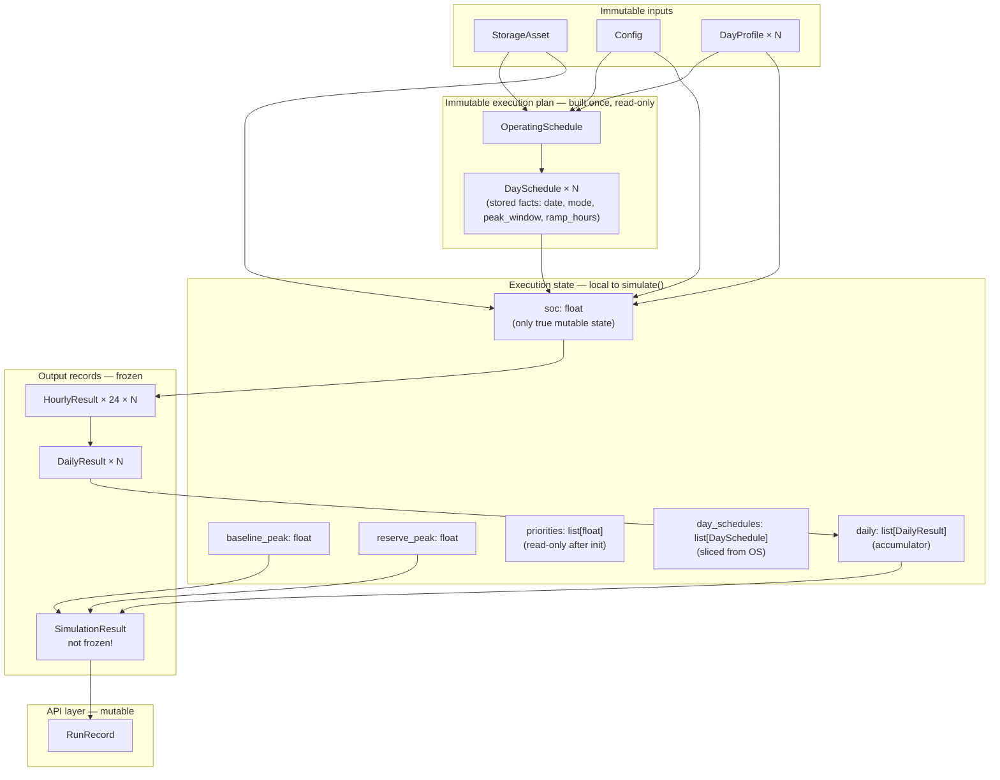

# Simulation State Model

This document inventories every object representing simulator state in `src/owr/`, identifies duplication and ownership, and proposes a consolidated `SimulationState` model. No implementation code is included; the goal is to clarify what state exists, where it lives, and what a cleaner model would look like.

---

## State Inventory

### Immutable execution plan — built once, read by every consumer

**`OperatingSchedule`** (frozen, `models.py`) — Phase 6 addition

A pre-computed immutable schedule that spans the entire simulation horizon. Built once by `schedule.build_schedule()` and read (never modified) by every consumer: `simulator`, `dispatch`, `recharge`, `metrics`.

| Field | Type | Role |
|---|---|---|
| `days` | `dict[date, DaySchedule]` | One day's classification per date |

**`DaySchedule`** (frozen dataclass, `models.py`) — Phase 6 addition

One day's operating classification and derived properties (cached).

| Field | Type | Role | Mutated |
|---|---|---|---|
| `date` | `date` | Calendar date | Never |
| `mode` | `DayMode` | NON_EVENT, PRE_CHARGE, or ACTIVE_EVENT | Never (derived from stress windows) |
| `peak_window` | `PeakWindow \| None` | Highest-summing rolling window (None except on active days) | Never |
| `ramp_hours` | `int` | Ramp length (0+ hours) | Never |
| `dispatch_window` | `DispatchWindow` (cached) | Planned ramp-up → peak → ramp-down slots | Derived, never stored twice |
| `hours` | `tuple[HourState, ...]` (cached) | 24 hour classifications per day | Derived, never stored twice |

**One stored fact per day:** `date`, `mode`, `peak_window`, `ramp_hours` are the only stored fields. `dispatch_window` and `hours` are cached properties derived from these three values. No two fields can disagree because hour classifications are never stored independently.

**HourState classification:**
- `NON_EVENT` – no storage operation allowed
- `PRE_CHARGE` – wind charges storage
- `ACTIVE_OFF_PEAK` – wind charges storage (during active event)
- `ACTIVE_RAMP_UP` – discharge ramps up
- `ACTIVE_PEAK` – discharge at peak
- `ACTIVE_RAMP_DOWN` – discharge ramps down

**Mutual exclusion by construction:** A charging hour never discharges, and a dispatch hour never charges. This is enforced at the classification level, not at runtime.

---

### Execution state — local variables inside `simulator.simulate()`

These are the values that evolve during the simulation loop. None of them are named types; they are plain Python primitives and lists.

| Variable | Type | Role | Mutated |
|---|---|---|---|
| `soc` | `float` | Current state of charge (MWh). **The only true mutable simulation state.** | 2× per hour (discharge step, then charge step, both via `next_soc`) |
| `baseline_peak` | `float` | Running maximum of `h.gross_load` over all simulated hours | Once per hour |
| `reserve_peak` | `float` | Running maximum of `h.net_load` over all simulated hours | Once per hour |
| `priorities` | `list[float]` | Pre-computed priority score for each window day (report-only, D13) | Never after construction |
| `daily` | `list[DailyResult]` | Output accumulator — one frozen record appended per day | Once per day |
| `day_schedules` | `list[DaySchedule]` | Read-only; sliced from the pre-built `OperatingSchedule` | Never after construction |

`soc` is the simulation's entire evolving state. Everything else in the local scope is either a pre-computed input, a running aggregation for the output, or an output accumulator.

---

### Result objects — frozen after construction

**`HourlyResult`** (frozen dataclass, `models.py`)

One record per simulated hour. Carries a snapshot of the simulation at the end of each hour.

| Field | Type | Classification |
|---|---|---|
| `ts_hour` | `int` | Input echo (hour index 0–23) |
| `soc` | `float` | **Primary output** — SoC after both the discharge and charge steps |
| `charge` | `float` | **Primary output** — energy charged this hour (MWh), from `recharge.charge_request_mw` |
| `discharge` | `float` | **Redundant** — equals `discharge_peak + discharge_smooth` (see below) |
| `discharge_peak` | `float` | **Primary output** — peak-shaving component of discharge |
| `discharge_smooth` | `float` | **Primary output** — ramp-smoothing component of discharge |
| `gross_load` | `float` | Input echo — load before storage acts |
| `net_load` | `float` | Derived — `gross_load - discharge`; event-relative charge never enters net load (D2) |
| `capacity_margin` | `float \| None` | Derived — `available_capacity_mw - net_load`; `None` when no capacity was supplied |

`discharge` is stored alongside its two components even though `discharge = discharge_peak + discharge_smooth` always holds. This means any single discharge value is stored three times.

---

**`DailyResult`** (frozen dataclass, `models.py`)

One record per simulated day. Summarises the day and owns its hourly records.

| Field | Type | Classification |
|---|---|---|
| `date` | `date` | Input echo |
| `budget` | `float` | Derived — energy the asset was allowed to discharge on ACTIVE_EVENT days (0.0 otherwise) |
| `priority` | `float` | Derived — `0.7 × DemandPercentile + 0.3 × WindForecastFrac`; report-only, no longer used for budget allocation (D13) |
| `usable_energy` | `float` | Derived — `(soc_at_end_of_day - min_soc_mwh) × one_way_efficiency`; terminal-basis snapshot of `usable_energy(soc, asset)` at day close (F1) |
| `recharge_sufficiency_ratio` | `float \| None` | Derived — `recharge_available / next_day_need`, where `next_day_need` is the full `usable_energy` at day close; no budget fraction applies; `None` on the last day |
| `hourly` | `list[HourlyResult]` | **Primary output** — the 24 hourly records |

All scalar fields are derived from either the input `DayProfile`, the `DaySchedule` mode, the `soc` value at a specific moment, or the `hourly` list. None of them represent independently evolving state.

---

**`SimulationResult`** (dataclass, **not frozen**, `simulator.py`)

The return value of `simulate()`. Contains the complete output of one simulation run.

| Field | Type | Classification |
|---|---|---|
| `daily` | `list[DailyResult]` | **Primary output** — the authoritative record of everything that happened |
| `final_soc` | `float` | **Redundant** — equals `daily[-1].hourly[-1].soc`; stored for O(1) access |
| `baseline_peak_mw` | `float` | **Redundant** — equals `max(h.gross_load for d in daily for h in d.hourly)`; stored for O(1) access |
| `reserve_peak_mw` | `float` | **Redundant** — equals `max(h.net_load for d in daily for h in d.hourly)`; stored for O(1) access |

`SimulationResult` is **not frozen**, which means its fields can be mutated after `simulate()` returns. The API layer relies on this when attaching a result to a `RunRecord` after the run completes. The engine core never mutates it; the not-frozen status is an API convenience that leaks into the domain type.

---

### API layer state — mutable wrappers

**`RunRecord`** (mutable dataclass, `api/store.py`)

API lifecycle wrapper. Mutated in place by the route handler as the run progresses.

| Field | Type | Classification |
|---|---|---|
| `id`, `scenario_id` | `int` | Identity |
| `status` | `str` | **Mutable lifecycle state** — `pending → running → succeeded / failed` |
| `code_version` | `str` | Immutable after construction |
| `created_at` | `datetime` | Immutable after construction |
| `result` | `SimulationResult \| None` | **Mutable** — `None` until the run succeeds |
| `stress_windows` | `list` | **Mutable** — populated during the run |
| `decision_package` | `dict \| None` | **Mutable** — populated on demand |

`RunRecord` mixes two distinct concerns: API lifecycle state (`status`, `created_at`) and domain output (`result`, `stress_windows`). These are owned by the same object and both change during a request.

---

### Configuration objects — immutable inputs

These are not state in the simulation sense but parameterise every state transition. They are listed here for completeness.

| Object | Module | Classification |
|---|---|---|
| `StorageAsset` | `models.py` | Frozen config — capacity, power, efficiency, reserve fractions |
| `Config` | `config.py` | Frozen config — engine constants (weights, fractions, ladder) |
| `DayProfile` | `models.py` | Frozen input — 24-hour load and wind arrays for one day |
| `StressWindow` | `models.py` | Frozen detection output — event bounds |

---

## State Classification Summary



**Key pattern (Phase 6):** The immutable execution plan (OS, DS) is built once and distributed to all consumers before the loop starts. No consumer re-derives the schedule — all operate from the same authoritative plan. This eliminates the prior duplication where charge/discharge rules appeared in three different modules with different versions of the same logic.

---

## Duplicated State

### Phase 6 Consolidation

The event-relative recharge architecture eliminated a major class of duplication by introducing the immutable `OperatingSchedule` as a single source of truth for hour classification. Prior to Phase 6:

- `simulator._surplus_wind_recharge_mwh` implemented the recharge forecast
- `initial_soc.charge_from_wind` implemented the pre-event charge rule
- `metrics.recharge_opportunity_mw` implemented the post-hoc recharge opportunity

All three used different clamp rules (load-netting vs. no-netting) and could diverge silently. Phase 6 consolidated these into:

- `recharge.charge_request_mw(wind, hour_state)` — single authoritative dispatch-time rule
- `recharge.recharge_opportunity_mwh(days, day_schedules)` — single planning signal for budget

Both delegate the hour-state classification to the pre-built `OperatingSchedule`. No consumer re-derives the schedule.

---

### Remaining Duplications

### D1 — `DaySchedule` stores only facts; dispatch_window and hours are cached properties

**Design principle (not a flaw):** `DaySchedule` stores exactly three facts per day: `date`, `mode`, `peak_window`, `ramp_hours`. Two derived properties are cached:

- `dispatch_window` — the planned ramp-up → peak → ramp-down slots for the day
- `hours` — the 24 `HourState` values for the day

Because dispatch_window and hours are derived from the three facts and cached (never stored twice), **no two fields can disagree**. This was the original motivation for introducing `DaySchedule`: eliminating the bug class where hour classifications could be stored separately and drift apart.

### D2 — `SimulationResult.final_soc` duplicates `daily[-1].hourly[-1].soc`

`final_soc` is the SoC at the end of the last hour of the last simulated day. That same value is already stored as `daily[-1].hourly[-1].soc`. The field exists for O(1) access convenience. There are now two sources of truth; if a bug in the post-processing path overwrites one but not the other, they diverge silently.

### D3 — `SimulationResult.baseline_peak_mw` and `reserve_peak_mw` duplicate the hourly record

Both values are the maximum of a field over all `HourlyResult` records. They are re-derivable from `daily` in O(days × 24) time. They exist because `simulate()` computes them cheaply during the loop (one comparison per hour) rather than requiring a post-hoc scan. The tradeoff is the same as D2: two sources of truth, and the values are not provably consistent with `daily` without re-scanning.

### D4 — `HourlyResult.discharge` duplicates `discharge_peak + discharge_smooth`

`discharge_peak` and `discharge_smooth` are the two allocation components. Their sum is `discharge`. All three are stored. Storing the total alongside its components means any query that needs the total (e.g., `sum(h.discharge for ...)`) works without arithmetic, but the representation is over-determined: changing `discharge_peak` without updating `discharge` would produce an inconsistent record. Since `HourlyResult` is frozen this cannot happen at runtime, but it means the schema implies a constraint (`discharge = discharge_peak + discharge_smooth`) that is nowhere enforced by the type system.

---

## Mutable vs. Immutable State

| Object | Mutable? | Why |
|---|---|---|
| `soc` (local) | Yes | Core simulation variable; advances every step |
| `baseline_peak`, `reserve_peak` (local) | Yes | Running max trackers |
| `daily` list (local) | Yes | Accumulator; each element is frozen |
| `OperatingSchedule` | No (frozen) | Execution plan; built once, read by all consumers |
| `DaySchedule` | No (frozen) | One day's plan; stored facts never change |
| `HourlyResult` | No (frozen) | Immutable snapshot |
| `DailyResult` | No (frozen) | Immutable snapshot |
| `SimulationResult` | **Technically yes** (not frozen) | API layer mutates it post-creation |
| `RunRecord` | Yes | API lifecycle state machine |
| `StorageAsset`, `Config`, `DayProfile` | No (frozen) | Inputs; must not change during simulation |

**Phase 6 improvement:** The execution plan (`OperatingSchedule`, `DaySchedule`) is now explicitly immutable and frozen, enforcing the design principle "one stored fact per day" at the type level. Prior to Phase 6, hour classifications could be (and were) stored and re-derived independently in different modules, violating this principle.

The single structural anomaly remains: `SimulationResult` being not frozen. Every other domain output object is frozen. The not-frozen status allows the API layer to attach the result to a `RunRecord` after the fact, but it also means the engine's output record can be mutated by any holder.

## Proposed Consolidated Model

The proposed model names the currently unnamed execution state, separates inputs from outputs clearly, and eliminates duplication in the summary fields.

### `SimulationInputs` (frozen)

Bundles everything the engine reads but never writes. Currently these are separate parameters to `simulate()`.

```
SimulationInputs
  asset:                  StorageAsset
  config:                 Config
  window_days:            tuple[DayProfile, ...]
  starting_soc:           float
  available_capacity_mw:  float | None
  dispatch_weights:       DispatchWeights
```

`DispatchWeights` is a minimal two-field frozen dataclass (`peak_weight`, `smooth_weight`) extracted from the current mix of `Config` defaults and `simulate()` keyword arguments.

### `DispatchWeights` (frozen)

```
DispatchWeights
  peak_weight:    float
  smooth_weight:  float
```

Currently `peak_weight` and `smooth_weight` default from `Config.default_peak_weight` / `Config.default_smooth_weight` but are overridable as separate parameters to `simulate()`. Naming the pair gives the concept a type.

### `SimulationExecution` (mutable during run)

Names the currently unnamed execution state. Once `simulate()` returns, this object is either discarded or sealed.

```
SimulationExecution
  soc:        float           ← the only evolving state
  day_index:  int             ← current position in window_days
  priorities: tuple[float]    ← pre-computed, read-only after init
```

`baseline_peak` and `reserve_peak` are tracking variables that serve only as efficient inputs to `SimulationOutput`. They could live here or be eliminated entirely (see Design Tradeoffs below).

### `SimulationOutput` (frozen after run completes)

Replaces the current `SimulationResult`. The three redundant summary fields become computed properties derived from `daily`.

```
SimulationOutput
  daily:  tuple[DailyResult, ...]    ← the authoritative record

  # properties (not stored):
  final_soc          → daily[-1].hourly[-1].soc
  baseline_peak_mw   → max(h.gross_load  for all hours)
  reserve_peak_mw    → max(h.net_load    for all hours)
  total_discharged_mwh → sum(h.discharge for all hours)
  total_charged_mwh    → sum(h.charge    for all hours)
```

`daily` is a `tuple`, not a `list`, to enforce immutability after construction.

### `HourlyResult` (revised)

Remove `discharge` as a stored field. Keep `discharge_peak` and `discharge_smooth` as the two primary values; expose `discharge` as a property (`discharge_peak + discharge_smooth`). This eliminates D3 and enforces the constraint by construction.

Alternatively, keep `discharge` and remove the components if callers rarely need the split. The right choice depends on whether the split is used more than the total (currently both the CLI report and the `sweep` module use only the total).

### `SimulationState` (root)

```
SimulationState
  inputs:     SimulationInputs      ← frozen
  execution:  SimulationExecution   ← mutable during run, then discarded
  output:     SimulationOutput | None  ← None until run completes, then frozen
```

`SimulationState` is the root object that describes a simulation at any point: before it runs (`output = None`), during execution (`execution.soc` is live), or after it completes (`output` is populated and `execution` can be discarded).

### `RunRecord` (revised)

The API layer `RunRecord` should own lifecycle state and hold a reference to `SimulationState`, not directly to `SimulationResult`. This separates the persistence concern from the domain concern.

```
RunRecord
  id, scenario_id:   int
  status:            str     ← pending / running / succeeded / failed
  code_version:      str
  created_at:        datetime
  simulation_state:  SimulationState | None   ← replaces result + stress_windows
  decision_package:  dict | None
```

`stress_windows` is part of the simulation — specifically the detection step that precedes `simulate()`. In the consolidated model it belongs inside `SimulationState.inputs` (or as a sibling field on `SimulationState`), not on `RunRecord`.

---

## Design Tradeoffs

### T1 — Derived properties vs. stored summary scalars

**Current approach:** Store `final_soc`, `baseline_peak_mw`, and `reserve_peak_mw` as fields on `SimulationResult`. They are computed once during the loop at zero additional cost (one comparison and one assignment per hour) and then available in O(1).

**Proposed approach:** Make them computed properties on `SimulationOutput`. Access requires an O(days × 24) scan.

**Tradeoff:** For a typical 7-day window (168 hours) the scan cost is negligible. The benefit is a single source of truth: `final_soc` can never disagree with `daily[-1].hourly[-1].soc` because the property *is* that traversal. The risk is that callers who access `baseline_peak_mw` in a tight loop (e.g., `sweep.run_sweep` uses `result.baseline_peak_mw` once per size point, which is fine) pay a scan that used to be free. **Recommendation: use properties; the scan cost is negligible at this scale.**

---

### T2 — Context object vs. pure function

**Current approach:** `simulate()` is a pure function. Inputs come in as arguments; output comes out as a return value. No shared object holds both.

**Proposed approach:** `SimulationState` is a context object that holds inputs, evolving state, and output together.

**Tradeoff:** The pure-function approach is easier to reason about (no hidden state, no shared mutations between caller and callee), easier to test (just call the function), and easier to compose (multiple calls can share the same inputs). The context-object approach makes the state explicit and named — a reader can see what the simulation "knows" at any point — but it introduces a shared mutable object and the question of who owns it. For a POC that stays single-threaded the context object is fine; for a future multi-run or async execution model the pure function is safer. **Recommendation: keep the pure-function signature for `simulate()`; use `SimulationInputs` as a named bundle to reduce the argument count, and return `SimulationOutput` instead of `SimulationResult`.**

---

### T3 — Execution state in a dataclass vs. local variables

**Current approach:** `soc`, `baseline_peak`, `reserve_peak`, `priorities`, and `daily` are local variables in `simulate()`. They are invisible to the caller between steps.

**Proposed approach:** Wrap them in `SimulationExecution` so the mid-simulation state has a name and a type.

**Tradeoff:** Local variables are the simplest representation for state that is created, used, and discarded within one function call. Wrapping them in a dataclass enables two things: (1) passing the execution state to a helper function without listing every variable as a parameter (solves R09 from the refactoring candidates), and (2) inspecting mid-simulation state in tests or debugging. The cost is a small object allocation and an extra layer of naming. **Recommendation: introduce `SimulationExecution` if and when `_step_hour` is extracted; the extraction is what makes the dataclass useful.**

---

### T4 — `SimulationResult` not being frozen

**Current approach:** `SimulationResult` is not frozen. The API layer assigns `run.result = result` after the run, which works fine, but the not-frozen status means the domain output can be mutated by anyone holding a reference.

**Proposed approach:** `SimulationOutput` is frozen (`frozen=True`). The API layer holds it via `SimulationState`, which can be replaced (the `RunRecord` field changes from `None` to a completed state) without mutating the `SimulationOutput` itself.

**Tradeoff:** `frozen=True` prevents accidental post-hoc mutation and makes the Global Interface Contract ("components shall not modify each other's output") enforceable by the type system rather than only by convention. The only cost is that any code that currently mutates `SimulationResult` after construction will break — and there is none: the API layer does not mutate `result` after it is assigned. **Recommendation: make `SimulationOutput` frozen.**

---

### T5 — The `discharged_today` dead variable

The dead `discharged_today` accumulator has been removed from the inner hourly loop. The proposal below stays open and is out of scope for this pass.

**Tradeoff:** Adding `discharged_mwh` to `DailyResult` would eliminate the `sum(h.discharge for h in d.hourly)` expressions in `cli._build_report` and `sweep.run_sweep` (both currently re-compute it). The corresponding `charged_mwh` field (currently `sum(h.charge for h in d.hourly)`) would be symmetric. **Recommendation: add `discharged_mwh` and `charged_mwh` to `DailyResult`.**

---

### T6 — Triple-storage of `discharge` in `HourlyResult`

`HourlyResult` stores `discharge`, `discharge_peak`, and `discharge_smooth`. Two of the three are sufficient; the third is always determined by the other two.

**Option A — Remove `discharge`, expose as property.** The total is `discharge_peak + discharge_smooth`. Callers that aggregate discharge (e.g., `sum(h.discharge for ...)`) can use the property transparently. The schema constraint becomes structurally enforced.

**Option B — Remove the components, keep `discharge`.** The peak/smooth split is currently reported in the hourly output and used by the CLI. If it turns out the split is never needed downstream (callers only ever use the total), this option reduces storage without changing any caller.

**Option C — Keep all three** (status quo). Easiest for callers; schema redundancy accepted.

**Tradeoff:** The split (`discharge_peak`, `discharge_smooth`) gives engineers visibility into which dispatch objective drove each hour's draw. This visibility is valuable during model validation and calibration. Removing the components would lose that information. **Recommendation: Option A — expose `discharge` as a property, keep the components as the stored truth. The property is zero-cost and callers remain unchanged.**

---

### T7 — `RunRecord` owning `SimulationResult` vs. `SimulationState`

**Current approach:** `RunRecord.result` holds a `SimulationResult`, a domain type defined in `simulator.py`. This means `api/store.py` imports from `simulator.py`, coupling the persistence layer to the engine's output type.

**Proposed approach:** `RunRecord` holds a `SimulationState`, which is either a new neutral type defined in `models.py` or a type from a dedicated `owr.simulation` module. The persistence layer's coupling is to a named state type, not to the engine's return value.

**Tradeoff:** This decoupling adds a layer between the route handler and the `SimulationResult`. The route handler would do `run.simulation_state.output.daily` instead of `run.result.daily`. The indirection is small but explicit. The benefit is that `simulator.py` can evolve its return type without the API layer needing to change, as long as `SimulationState` acts as a stable interface. **Recommendation: worth doing at the same time as making `SimulationOutput` frozen, since the two changes are complementary.**
